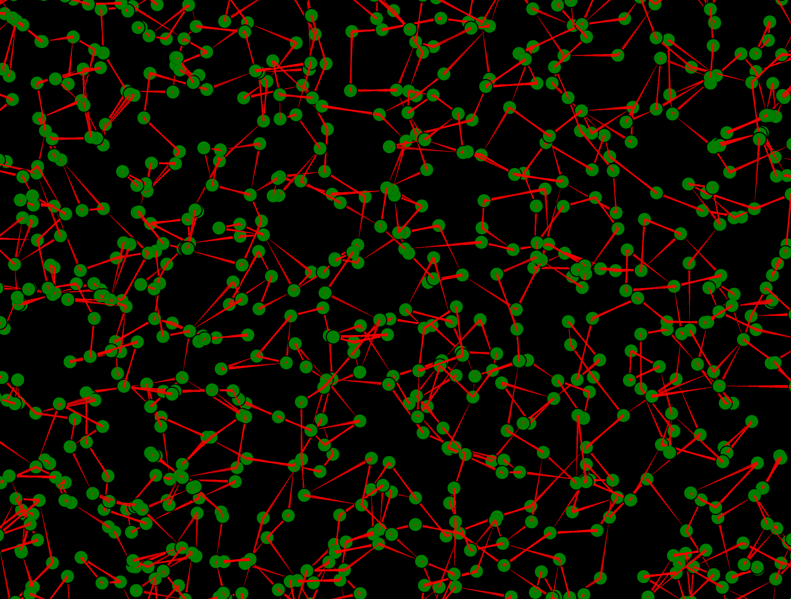
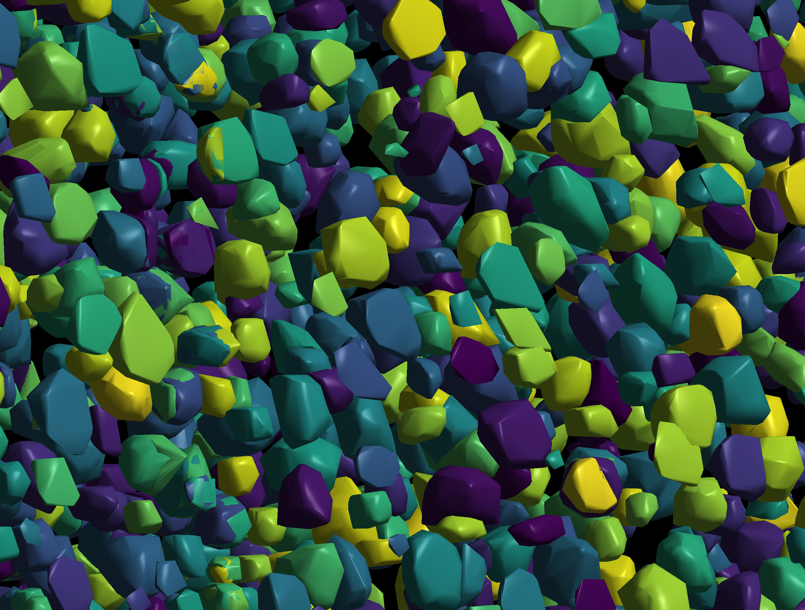

# `spatialdata` 3D @ scverse hackathon





## Installation

```bash
mkdir -p ~/code/scverse
cd ~/code/scverse
git clone git@github.com:edoumazane/spatial-3d-hack.git
cd ~/code/scverse/spatial-3d-hack
```

## Download Fang et al., 2024 preprint data (derived)

```bash
cd ~/code/scverse/spatial-3d-hack
conda env create -f environment_gdown.yml

mkdir -p  ~/code/scverse/spatial-3d-hack/data/Fang_preprint/mouse_cortex_100um
cd $_
conda activate gdown
gdown "https://drive.google.com/uc?export=download&id=15kTpS4RksoiIwMnCN_cVSYqdPsaWgXOe"
```
<!--
## Download Schott et al., 2024 data (original)
```bash
export DATA_DIR=/data/etienne.doumazane/st/Schott_2024
export DATA_DIR=/Users/edmz/data/st/Schott_2024
mkdir -p $DATA_DIR/original
cd $DATA_DIR/original
wget https://zenodo.org/records/11395256/files/zenodo_mLN_mLN_DAPI_panCK_VIM.ome.tif
mkdir -p $DATA_DIR/original/
```
[Schott 2024: Open-ST: High-resolution spatial transcriptomics in 3D](https://www.cell.com/cell/fulltext/S0092-8674(24)00636-6)

[GitHub repo: Open-ST: open-source spatial transcriptomics](https://github.com/rajewsky-lab/openst)
```bash
cd ~/code/scverse/spatial-3d-hack/scripts
conda activate napari-spatialdata
python view_shapes.py
``` -->
